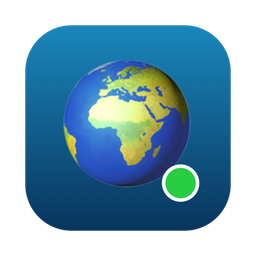
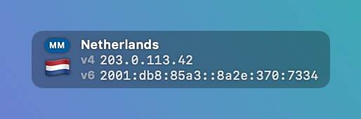
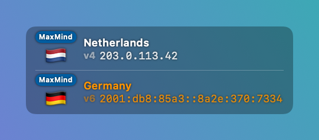

# IPMonit



A tiny macOS menu bar utility that always shows **which country you access the internet from** — your external IP address and the country flag of your internet exit point (e.g. your VPN server).

Made for one simple purpose: a permanent, glanceable reminder of where your traffic exits, so you never forget your VPN is off (or on, or connected to the wrong country).

## What it looks like

| Normal | Country mismatch — possible VPN leak | No internet |
|:---:|:---:|:---:|
|  |  |  |

The semi-transparent floating window over a desktop; the same info lives in the menu bar dropdown. IP addresses on the screenshots are fake documentation addresses (RFC 5737 / RFC 3849) — screenshots are rendered by `scripts/make-screenshots.sh`, real data never leaves the machine.

## Features

- **Menu bar flag** — the flag of your current exit country lives in the menu bar. The dropdown shows full IPv4/IPv6 details.
- **Optional floating window** — a small semi-transparent pill that stays on top of all windows, on every desktop, even over fullscreen apps. Drag it anywhere; the position is remembered.
- **Near-realtime** — endpoints are polled every 3 seconds, and network changes (VPN on/off, Wi-Fi switch) trigger an immediate refresh via `NWPathMonitor`.
- **IPv4 and IPv6 checked independently** — via Cloudflare (`1.1.1.1` and `2606:4700:4700::1111`), so you see exactly what dual-stack services see. A protocol that isn't available is simply hidden.
- **VPN-friendly geolocation** — the country comes from a MaxMind-based database (`api.country.is`), the same kind most "what is my IP" sites use. This matters for VPN "virtual locations": Cloudflare's own database reports the physical server location (often France or the Netherlands), while MaxMind respects the country the provider registered. Cloudflare's estimate is used as a fallback.
- **VPN leak hint** — if the IPv4 and IPv6 countries don't match (a classic sign of one protocol leaking outside your VPN tunnel), the IPv6 block is shown separately with its own flag, highlighted orange, and the menu bar flag gets a ⚠️.
- **Offline indicator** — when the internet is unreachable, the app says so instead of showing stale data.
- **Launch at login** — toggle in the menu (uses the system `SMAppService`).
- **10 languages** — English (default), Русский, Español, Deutsch, Français, Italiano, Português, 中文, 日本語, 한국어. Switchable from the menu; country names are localized too.

## Privacy

The app makes HTTPS requests to Cloudflare's public trace endpoints (`https://1.1.1.1/cdn-cgi/trace` and the IPv6 equivalent) to learn the external IPs, and to `https://api.country.is/<ip>` to geolocate them (cached per IP, so it is only called when the address actually changes). Nothing else: no accounts, no API keys, no analytics, no data stored or sent anywhere.

## Install (prebuilt)

1. Download [`dist/IPMonit.zip`](dist/IPMonit.zip) and unzip it.
2. Move `IPMonit.app` to `/Applications`.
3. First launch: the app is not notarized, so macOS will block a normal double-click. Either **right-click the app → Open → Open**, or remove the quarantine flag in Terminal:

   ```sh
   xattr -dr com.apple.quarantine /Applications/IPMonit.app
   ```

4. Look for the flag in your menu bar (if you don't see it, your menu bar may be full — Cmd-drag other icons to make room). The floating window can be toggled from the menu.

Requires macOS 13 Ventura or later.

## Build from source

Requirements: macOS 13+, Xcode Command Line Tools (`xcode-select --install`). No Xcode project needed — it's a plain Swift Package.

```sh
git clone <this repo>
cd ip-monit-2
./build-app.sh
ditto build/IPMonit.app /Applications/IPMonit.app
```

`build-app.sh` compiles a release binary with SwiftPM, wraps it into an `.app` bundle with the icon (regenerated by `scripts/make-icon.sh` if missing), and ad-hoc signs it.

Dev variant with extra info in the About dialog: `./build-app.sh -dev`.

To preview the "country mismatch" layout with fake data:

```sh
open /Applications/IPMonit.app --args --mock-mismatch
```

## How it works

- Two endpoints are queried in parallel: `https://1.1.1.1/cdn-cgi/trace` (the IP literal forces IPv4) and `https://[2606:4700:4700::1111]/cdn-cgi/trace` (forces IPv6). Each returns the caller's IP. The country for each IP is then resolved via `api.country.is` (MaxMind GeoLite2) with a per-IP cache; Cloudflare's `loc=` field is the fallback.
- The window is a borderless, non-activating `NSPanel` at floating level hosting a SwiftUI view — clicking it never steals focus from your current app.
- Country codes become flag emoji via Unicode regional indicators; country names come from the system `Locale` in the selected UI language.
