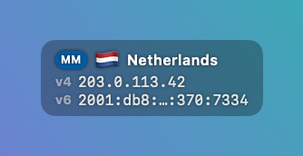

# IPMonit

[English](README.md) | **Русский**


Крошечная утилита для меню-бара macOS, которая всегда показывает, **из какой страны вы выходите в интернет** — ваш внешний IP-адрес и флаг страны точки выхода (например, VPN-сервера).

Сделана ради одной простой цели: постоянная напоминалка перед глазами о том, где ваш трафик выходит в сеть, — чтобы не забыть, что VPN выключен (или включён, или подключён не к той стране).

## Как это выглядит

| Обычный режим | Компактный | Страны не совпадают — возможная утечка VPN | Нет интернета |
|:---:|:---:|:---:|:---:|
|  |  |  |  |

Полупрозрачное плавающее окошко поверх рабочего стола; та же информация есть в выпадающем меню в меню-баре. IP-адреса на скриншотах — фейковые документационные адреса (RFC 5737 / RFC 3849): скриншоты рендерятся скриптом `scripts/make-screenshots.sh`, реальные данные не покидают машину.

## Возможности

- **Флаг в меню-баре** — флаг текущей страны выхода живёт в меню-баре. В выпадающем меню — полные данные IPv4/IPv6.
- **Опциональное плавающее окошко** — маленькая полупрозрачная плашка поверх всех окон, на всех рабочих столах, даже над полноэкранными приложениями. Перетаскивается куда угодно; позиция запоминается. Двойной клик по окошку открывает меню приложения (удобно, когда иконка в меню-баре скрыта из-за тесноты).
- **Компактный режим** — ещё меньшее окошко: флаг и бейдж источника встают в строку с названием страны, а IPv6 сокращается до первых и последних символов. Включается в меню («Компактное окошко»).
- **Почти в реальном времени** — опрос каждые 3 секунды, а смена сети (VPN вкл/выкл, переключение Wi-Fi) вызывает немедленное обновление через `NWPathMonitor`.
- **IPv4 и IPv6 проверяются независимо** — через Cloudflare (`1.1.1.1` и `2606:4700:4700::1111`), так что вы видите ровно то, что видят dual-stack сервисы. Недоступный протокол просто скрывается.
- **Виртуальная и физическая страна** — опция меню («Отображаемая страна») переключает между страной, зарегистрированной в геобазах (MaxMind — то, что видят сайты), и физическим расположением сервера (оценка Cloudflare). Активный источник показан маленьким бейджем (MM = MaxMind / CF = Cloudflare) над флагом в окошке. См. раздел [Виртуальные локации VPN](#виртуальные-локации-vpn-зарегистрированная-и-физическая-страна) ниже.
- **Подсказка об утечке VPN** — если страны IPv4 и IPv6 не совпадают (классический признак утечки одного из протоколов мимо VPN-туннеля), блок IPv6 показывается отдельно со своим флагом, подсвечивается оранжевым, а к флагу в меню-баре добавляется ⚠️.
- **Индикатор офлайна** — когда интернет недоступен, приложение говорит об этом, а не показывает устаревшие данные.
- **Автозапуск при входе** — переключатель в меню (используется системный `SMAppService`).
- **10 языков** — английский (по умолчанию), русский, испанский, немецкий, французский, итальянский, португальский, китайский, японский, корейский. Переключается в меню; названия стран тоже локализуются.

## Виртуальные локации VPN: зарегистрированная и физическая страна

«Страна» IP-адреса — это запись в базе данных, а не физический факт, и для выходных адресов VPN записи часто расходятся с географией. Многие локации VPN (особенно экзотические вроде Афганистана или Беларуси) — **виртуальные**: сервер физически стоит в дата-центре во Франции или Нидерландах, а провайдер регистрирует диапазон адресов на заявленную страну в геобазах вроде MaxMind. Держать настоящее железо в таких странах медленно, рискованно или юридически сложно — поэтому провайдеры «переносят» локацию на бумаге, а крупные даже честно помечают такие серверы как виртуальные в своих приложениях.

В какой стране вы «находитесь», зависит от того, кто смотрит:

- **Сайты и сервисы «what is my IP»** в основном используют базы семейства MaxMind → видят зарегистрированную (виртуальную) страну. Именно поэтому виртуальные локации работают для обхода геоблокировок.
- **Базы на основе измерений** (как у Cloudflare — по маршрутам и задержкам) → видят, где сервер находится физически.

IPMonit показывает оба взгляда и позволяет выбрать в меню («Отображаемая страна»):

- **Виртуальная — MaxMind** (по умолчанию): страна, в которой вас «видят» сайты.
- **Физическая — Cloudflare**: страна, где выходной сервер живёт на самом деле.

Если для вашей VPN-локации они различаются — провайдер использует виртуальную локацию: трафик реально идёт через другую страну, со всеми вытекающими для задержек и юрисдикции.

## О чём говорит строка IPv6

При подключённом VPN строка IPv6 — сама по себе диагностика; возможны три состояния:

1. **v6 виден, страна совпадает с v4** — VPN туннелирует оба протокола. Идеал.
2. **v6 виден отдельным оранжевым блоком с другой страной** — IPv6 утекает мимо VPN-туннеля: сайты с поддержкой IPv6 видят ваш реальный адрес и страну. Лечится отключением IPv6 в системе или включением защиты от IPv6-утечек в VPN-клиенте.
3. **v6 скрыт, хотя в вашей сети IPv6 обычно есть** — VPN-клиент полностью блокирует IPv6 вместо туннелирования (защита от утечек). Безопасно, но IPv6-связность на время подключения теряется.

Недоступный протокол всегда скрывается, поэтому если в вашей сети IPv6 нет вовсе — строка v6 просто никогда не появляется.

## Приватность

Приложение делает HTTPS-запросы к публичным trace-эндпоинтам Cloudflare (`https://1.1.1.1/cdn-cgi/trace` и IPv6-аналог), чтобы узнать внешние IP, и к `https://ipwho.is/<ip>` (с фолбэком на `https://api.country.is/<ip>`) для их геолокации — результат кэшируется по IP, так что запрос уходит только при фактической смене адреса. Больше ничего: без аккаунтов, без API-ключей, без аналитики; никакие данные никуда не сохраняются и не отправляются.

## Установка (готовая сборка)

1. Скачайте [`dist/IPMonit.zip`](dist/IPMonit.zip) и распакуйте.
2. Переместите `IPMonit.app` в `/Applications`.
3. Первый запуск: приложение не нотаризовано, поэтому macOS заблокирует обычный двойной клик. Либо **правый клик по приложению → «Открыть» → «Открыть»**, либо снимите карантин в Терминале:

   ```sh
   xattr -dr com.apple.quarantine /Applications/IPMonit.app
   ```

4. Ищите флаг в меню-баре (если его не видно — меню-бар переполнен, перетащите другие иконки с зажатым Cmd, чтобы освободить место). Плавающее окошко включается из меню.

Требуется macOS 13 Ventura или новее.

## Сборка из исходников

Требования: macOS 13+, Xcode Command Line Tools (`xcode-select --install`). Xcode-проект не нужен — это обычный Swift Package.

```sh
git clone <this repo>
cd ip-monit-2
./build-app.sh
ditto build/IPMonit.app /Applications/IPMonit.app
```

`build-app.sh` компилирует релизный бинарник через SwiftPM, заворачивает его в `.app` с иконкой (перегенерируется `scripts/make-icon.sh`, если отсутствует) и подписывает ad-hoc.

Dev-вариант с дополнительной информацией в диалоге About: `./build-app.sh -dev`.

Предпросмотр раскладки «страны не совпали» на фейковых данных:

```sh
open /Applications/IPMonit.app --args --mock-mismatch
```

## Как это работает

- Параллельно опрашиваются два эндпоинта: `https://1.1.1.1/cdn-cgi/trace` (IP-литерал форсирует IPv4) и `https://[2606:4700:4700::1111]/cdn-cgi/trace` (форсирует IPv6). Каждый возвращает IP клиента. Зарегистрированная страна для каждого IP затем определяется через `ipwho.is` (с фолбэком на `api.country.is`), с кэшем по IP; поле `loc=` Cloudflare — это «физический» взгляд и последний фолбэк.
- Окно — безрамочная неактивирующаяся `NSPanel` на уровне floating со SwiftUI-вью внутри: клик по нему никогда не забирает фокус у текущего приложения.
- Коды стран превращаются во флаги-эмодзи через Unicode regional indicators; названия стран берутся из системной `Locale` на выбранном языке интерфейса.
